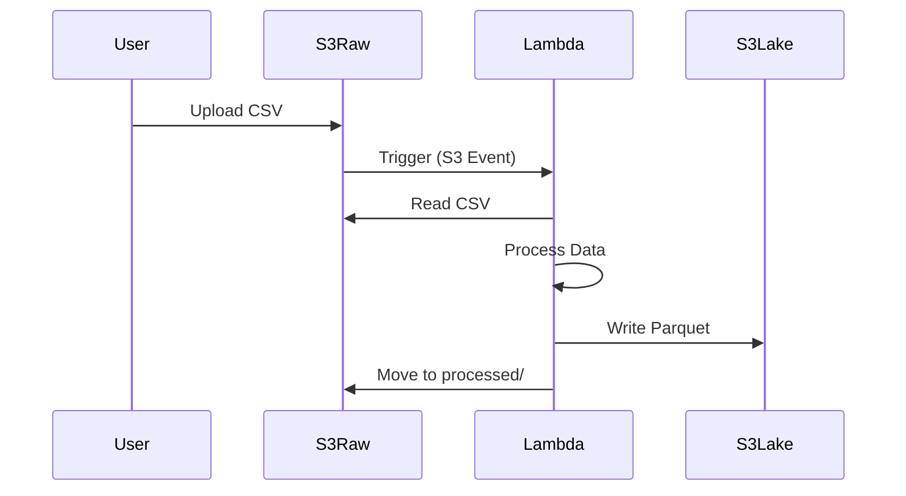
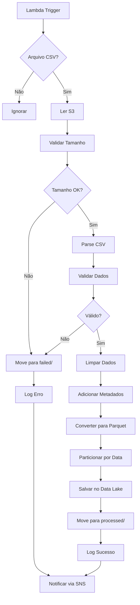
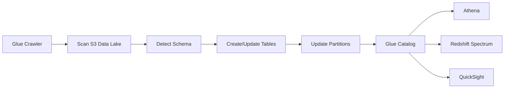
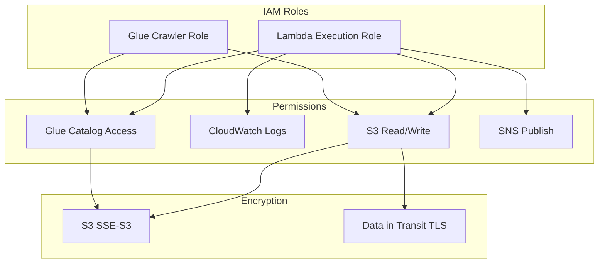

```mermaid
graph TB
    subgraph "Upload de Dados"
        USER[👤 Usuário/Sistema]
        CSV[📄 Arquivo CSV]
    end
    
    subgraph "AWS Cloud"
        subgraph "Camada de Ingestão"
            S3RAW[(🗄️ S3 Raw Bucket<br/>input/)]
            S3EVENT[📨 S3 Event<br/>ObjectCreated]
        end
        
        subgraph "Camada de Processamento"
            LAMBDA[⚡ Lambda Function<br/>csv-ingestor]
            PROCESS[🔄 Processamento:<br/>- Validação<br/>- Limpeza<br/>- Transformação<br/>- Conversão Parquet]
        end
        
        subgraph "Camada de Armazenamento"
            S3LAKE[(🗄️ S3 Data Lake<br/>processed/<br/>year/month/day/)]
        end
        
        subgraph "Camada de Catalogação"
            CRAWLER[🕷️ Glue Crawler]
            CATALOG[(📚 Glue Catalog<br/>Metadata)]
        end
        
        subgraph "Camada de Consulta"
            ATHENA[🔍 Amazon Athena]
            REDSHIFT[📊 Redshift Spectrum]
            QUICKSIGHT[📈 QuickSight]
        end
        
        subgraph "Monitoramento"
            CWLOGS[📋 CloudWatch Logs]
            CWMETRICS[📊 CloudWatch Metrics]
            ALARM[🚨 CloudWatch Alarms]
            SNS[📧 SNS Topic<br/>Notificações]
            DASHBOARD[📊 CloudWatch Dashboard]
        end
        
        subgraph "Arquivos Processados"
            S3PROC[(📂 processed/original/)]
            S3FAIL[(❌ failed/)]
        end
    end
    
    USER -->|Upload CSV| CSV
    CSV -->|PUT| S3RAW
    S3RAW -->|Trigger| S3EVENT
    S3EVENT -->|Invoke| LAMBDA
    LAMBDA -->|Processa| PROCESS
    PROCESS -->|Parquet particionado| S3LAKE
    PROCESS -->|Sucesso| S3PROC
    PROCESS -->|Erro| S3FAIL
    S3LAKE -->|Agendado diariamente| CRAWLER
    CRAWLER -->|Atualiza| CATALOG
    CATALOG -->|Query| ATHENA
    CATALOG -->|Query| REDSHIFT
    ATHENA -->|Visualiza| QUICKSIGHT
    
    LAMBDA -->|Logs| CWLOGS
    LAMBDA -->|Metrics| CWMETRICS
    CWMETRICS -->|Threshold| ALARM
    ALARM -->|Notify| SNS
    CWMETRICS -->|Display| DASHBOARD
    
    style USER fill:#e1f5ff
    style S3RAW fill:#ff9900
    style LAMBDA fill:#ff9900
    style S3LAKE fill:#ff9900
    style CATALOG fill:#945DF2
    style ATHENA fill:#232F3E
    style CWLOGS fill:#FF4F8B
    style SNS fill:#FF4F8B
```

## Fluxo Detalhado

### 1. Ingestão


### 2. Processamento Lambda


### 3. Catalogação


## Componentes AWS

| Componente | Função | Custo Estimado |
|------------|--------|----------------|
| S3 Raw Bucket | Armazenamento temporário | $0.023/GB/mês |
| S3 Data Lake | Armazenamento permanente | $0.023/GB/mês |
| Lambda | Processamento | $0.20/1M requests |
| Glue Crawler | Catalogação | $0.44/DPU-hour |
| CloudWatch | Logs e monitoramento | $0.50/GB |
| SNS | Notificações | $0.50/1M requests |

## Particionamento de Dados

```
s3://data-lake-bucket/processed/
└── year=2024/
    └── month=01/
        └── day=15/
            ├── vendas.parquet
            ├── produtos.parquet
            └── clientes.parquet
```

## Segurança


